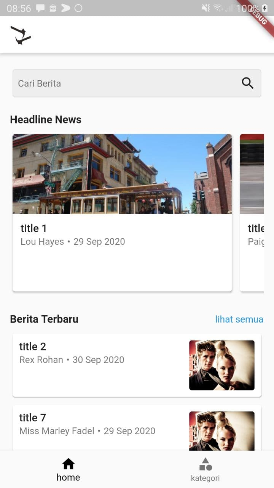
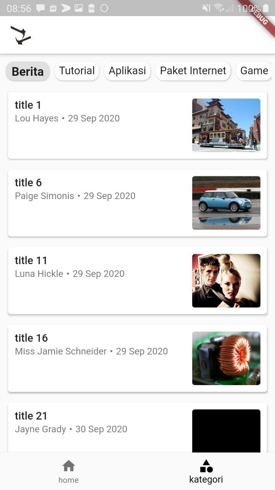
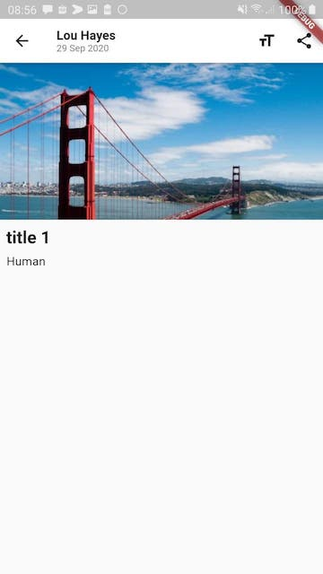

# news_basic_app
A News Basic Flutter application.

  

## Getting Started
A few resources to get you started if this is your first Flutter project:

- [Lab: Write your first Flutter app](https://flutter.dev/docs/get-started/codelab)
- [Cookbook: Useful Flutter samples](https://flutter.dev/docs/cookbook)

## What's Inside the App
- [NEW] BLOC Implementation on branch bloc
- Dummy API from Mockapi.io
- Resize text at detail article page
- Share feature

## What's Next?
- Splashscreen simulation
- Login feature
- Many more...

## Resources
- https://flutter.io
- https://medium.com/flutter-community/flutter-essential-what-you-need-to-know-567ad25dcd8f
- https://bloclibrary.dev/#/whybloc

## Contributing
Pull requests are welcome. For major changes, please open an issue first to discuss what you would like to change.

Please make sure to update tests as appropriate.